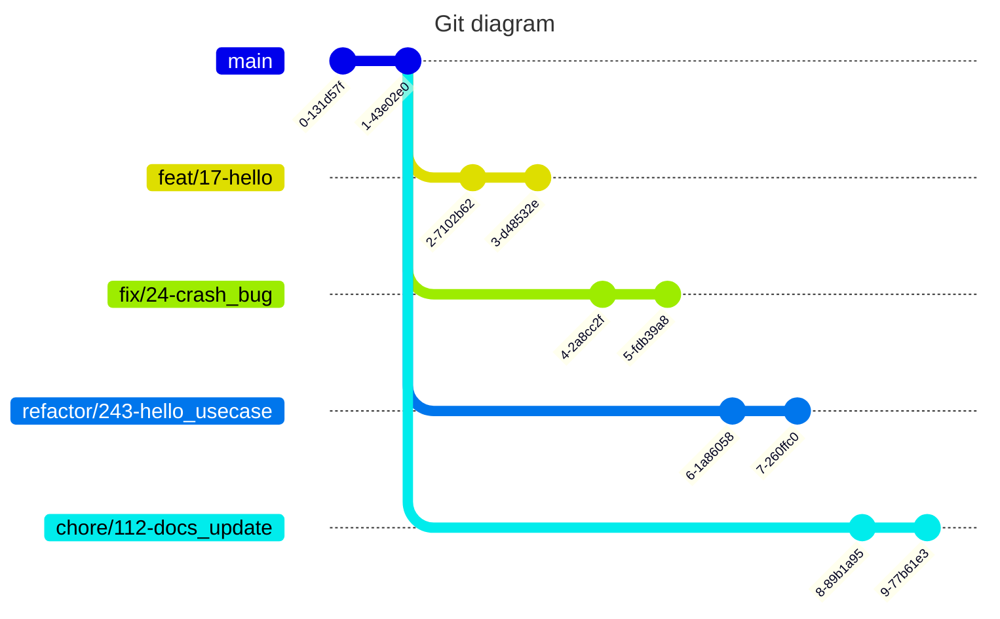

>※ 以下のルールは、必ずしも守らないといけないものではないので、運用に困ったとき参考にしてください

## Gitの運用ルール
ブランチおよびコミットメッセージのプレフィックスに「作業意図(用途: Usage)の明確化」のため、4つのシンプルなメッセージを付け加える

* `feat`: 
  * 機能の追加
* `fix`: 
  * バグ・仕様指摘の修正
* `refactor`:
  * コード構造・パフォーマンスの改善
* `chore`: 
  * プロジェクト内の雑用(ドキュメント更新、依存関係追加・更新..etc)

### ブランチモデル
基本的に`main`から用途別の4つのブランチを作成し、mainにそれぞれマージする

```
[usage]/[issue_num]-[work_name]
```

> `work_name`は、英語小文字で単語をつなげる場合は`_`を使用する

**examples**



### コミットメッセージ
ブランチと同様に、用途別の4つのコミットメッセージをそれぞれ作成する

```
[usage_emoji] [usage]: [commit_message]
```

>`commit_message`の部分は日本語で記述します

**examples**
```
✨ feat: helloコマンドを追加
```

```
🐛 fix: helloコマンドがクラッシュする問題を修正
```

```
♻️ refactor: helloコマンドのユースケースを追加
```

```
🏗️ chore: shuttleの依存関係を追加
```


> [!TIP]  
> **コミットメッセージのテンプレート**
> 
> 使用するツールは問わず、以下のようなコミットメッセージのテンプレートを用意しておくと便利です
> 
> 
>`commit_template.txt`
>```
># ✨ feat:
># 🐛 fix:
># ♻️ refactor:
># 🏗️ chore:
>```
>
>
>`.gitconfig`
>```
>[commit]
>template = ./[path]/commit_message_template.txt
>```
>
>`.gitconfig`の`commit.template`を設定しておくと、`git commit`時にテンプレートとして呼び出せる
